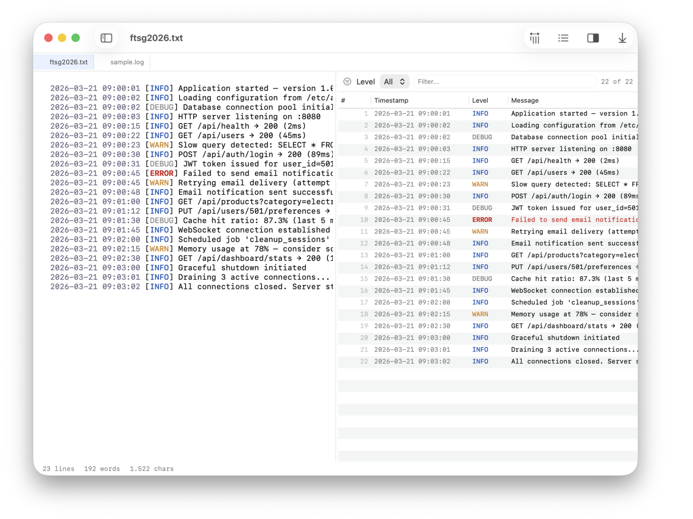

# TinyLog

A native macOS log file viewer. Color-coded levels, live tail mode, and automatic highlighting of timestamps, IPs, and stack traces.




## Features

- **Live tail mode** — follows new output as it's written, like `tail -f`
- **Level filtering** — filter by ERROR, WARN, INFO, DEBUG, TRACE
- **Dual-pane view** — raw log text alongside a structured, filterable table
- **Color-coded levels** — red for errors, orange for warnings, blue for info
- **Click-to-source** — click any table row to jump to that line in the editor
- **Syntax highlighting** — timestamps, IP addresses, quoted strings, stack traces
- **Timestamp extraction** — ISO, syslog, and Apache/Nginx formats
- **Sortable columns** — line number, timestamp, level, message
- **Text search** — real-time results across the log
- **Directory browsing** — navigate folders, subdirectories, and files
- **Quick open** — fuzzy file finder (Cmd+P)
- **Line numbers** — optional gutter with current line highlight
- **Word wrap** — toggle with Opt+Z
- **Font size control** — Cmd+/Cmd- to adjust, Cmd+0 to reset
- **Multiple windows** — each window has independent state
- **Light & dark mode** — follows system appearance
- **On-device AI** — Cmd+K to ask questions about your logs (CoreML, fully offline)
- **Open from Finder** — double-click `.log`, `.out`, or `.err` files to open in TinyLog

## Requirements

- macOS 26.0+
- Xcode 26+ (to build)

## Build

```bash
xcodebuild clean build \
  -project TinyLog.xcodeproj \
  -scheme TinyLog \
  -configuration Release \
  -derivedDataPath /tmp/tinybuild/tinylog \
  CODE_SIGN_IDENTITY="-"

cp -R /tmp/tinybuild/tinylog/Build/Products/Release/TinyLog.app /Applications/
```

## Keyboard Shortcuts

| Shortcut | Action |
|---|---|
| Cmd+O | Open file |
| Cmd+Shift+O | Open folder |
| Cmd+P | Quick open |
| Cmd+K | AI assistant |
| Cmd+F | Find |
| Cmd+Shift+N | New window |
| Cmd+= / Cmd+- | Font size |
| Cmd+0 | Reset font size |
| Opt+Z | Toggle word wrap |
| Opt+P | Toggle log preview |
| Opt+L | Toggle line numbers |
| Opt+T | Toggle tail mode |

## Tech

Built with SwiftUI, NSTextView, and TinyKit.

## Part of [TinySuite](https://tinysuite.app)

Native macOS micro-tools that each do one thing well.

| App | What it does |
|-----|-------------|
| [TinyMark](https://github.com/michellzappa/tinymark) | Markdown editor with live preview |
| [TinyTask](https://github.com/michellzappa/tinytask) | Plain-text task manager |
| [TinyJSON](https://github.com/michellzappa/tinyjson) | JSON viewer with collapsible tree |
| [TinyCSV](https://github.com/michellzappa/tinycsv) | Lightweight CSV/TSV table viewer |
| [TinyPDF](https://github.com/michellzappa/tinypdf) | PDF text extractor with OCR |
| **TinyLog** | Log viewer with level filtering |
| [TinySQL](https://github.com/michellzappa/tinysql) | Native PostgreSQL browser |

## License

MIT
